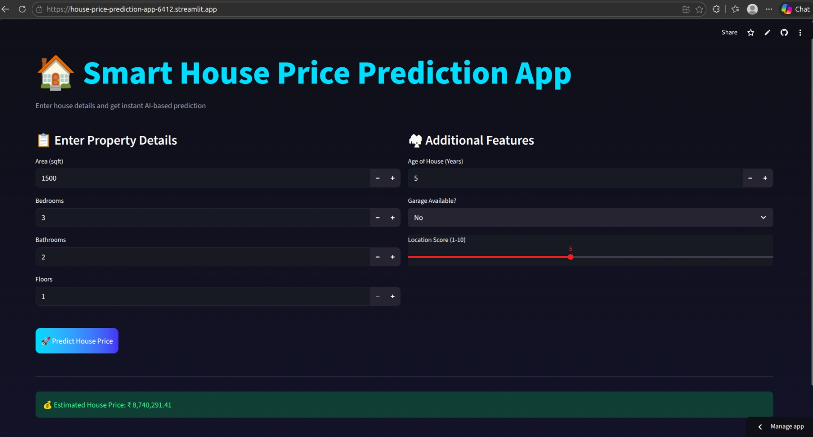

# 🏠 House Price Prediction App

A machine learning web application that predicts house prices based on key property features. Built using Streamlit, the app provides real-time predictions through an interactive dark-themed interface.

---

## 🚀 Live Demo

🔗 https://house-price-prediction-app-6412.streamlit.app/

---

## 📌 Project Overview

This project demonstrates end-to-end machine learning deployment:
- Data-based price prediction using a trained regression model
- Model serialization using pickle
- Deployment using Streamlit
- Hosting on Streamlit Community Cloud

The app allows users to enter property details and instantly receive an estimated house price.

---

## 🧠 Input Features

The model predicts house price using:

- Area (sqft)
- Bedrooms
- Bathrooms
- Floors
- Age of House (Years)
- Garage Availability (Yes/No)
- Location Score (1–10)

---

## 🛠 Tech Stack

- Python
- Streamlit
- Scikit-learn
- NumPy

---

## 📂 Repository Structure

house-price-prediction-app/ 
│ 
├── app.py 
├── requirements.txt 
└── model
     ── model.pkl 

---

## 📜 License

This project is created for educational and portfolio purposes.
